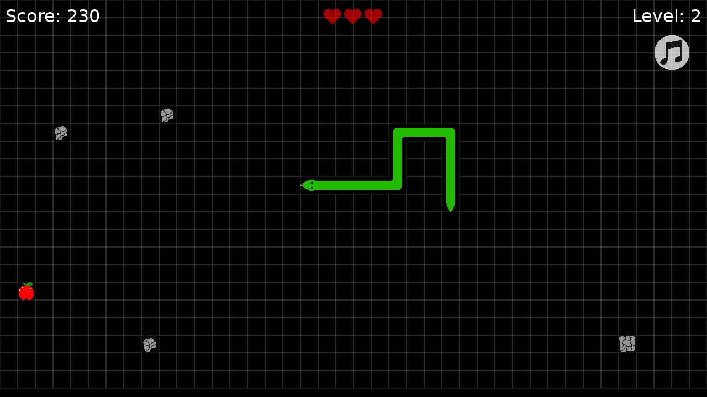

# Snake Löve

Snake game made in Lua LÖVE



## How to run

1. Install Lua LÖVE framework according to the [official
   website](https://love2d.org/).

1. Obtain this repo in any preferred way, e.g. `git clone` or download
   a zip directly from GitHub.

1. See [the official wiki](https://love2d.org/wiki/Getting_Started) for
   instructions how to start the game on your platform.

## Inspiration

The whole project is based on CS50 youtube videos:

* [part 1](https://youtu.be/ld_xcXdRez4)
* [part 2](https://youtu.be/UOzRK3p26Dw)

The original project files are available in [Colton's
repository](https://github.com/coltonoscopy/snake50).

### Enhancements in comparison to the original version

* All tiles are now rendered from custom made sprite sheet file instead
  of plain colored squares. Additional layer of logic was added to
  correctly rotate snake body tiles.

* Lives are now displayed using heart images.

* It's possible to mute music using `M` key. The appropriate icon is
  displayed to show the status.

* Grid lines can be hidden with `G` key.

## Building

Lua LÖVE supports portable zip-based format for easier distribution of
games. `.love` files should have `main.lua` file at the top level. You
can use `make` to automatically create `snake.love` file:

```shell
make build
```
